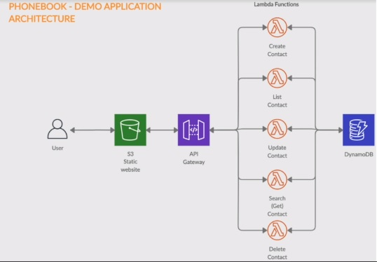

# What is Serverless
- Build and run applications and services without managing servers
- Serverless architecture are great for building web applicationsand APIs as well as data processing pipelines
- Just develop, deploy and monitor application

## Benefits
- No servers management
- Flexible scaling
- Highly available
- Only pay for what you use

## AWS Serverless Platform
- Compute: `Lambda`
- API Management: `API Gateway`
- Storage: `S3`
- Database: `DynamoDB`
- Inter-Process Messaging: `SQS` and `SNS`
- Analytics: `Kinesis` and `Athena`
- Orchestration: `AWS Step Function`
- Developer Tools: `AWS SAM`

## Serverless Platform Deep-Dive
### AWS Lambda
- Lets you run code without provisioning or managing servers
- Only pay for the compute time you consume
- You can set up your code to automatically trigger from other AWS services or call it directly from any web or mobile app
- Benefits:
   - No servers to manage
   - Continuous scaling
   - Sub-second metering
   - Consistent performance

### API Management - API Gateway
- Fully managed service that makes it easy for developers to `create`, `publish`, `maintain`, `monitor`, and `secure` APIs at any scale
- You can create `RESTful APIs` and `WebSocket APIs` that enable real-time two-way communication apps
    - RESTful API - architectural style for API that uses HTTP requests to access and use data
    - WebSocker API - an advanced technology that makes it possible to open a two-way interactive communication session between the user's browser and a server. With this API, you can send messages to a server and receive event-driver responses without having to poll the server for a reply
- It supports `containerized` and `serverless workload`, and as well as `web application`
- Benefits:
   - Efficient API development
   - Performance at any scale
   - Cost saving at scale
   - Easy monitoring
   - Flexible security control
   - RESTful API options

### Storage: S3
- S3 is an `object storage service` that offers scalability, data availability, security, and performance
- Use cases: websites, mobile application, backup and restore, archive, enterprise application, IoT devices, and big data analytics
- Benefits:
   - Performance, scalability, durability
   - Cost effective storage classes
   - Security, compliance and audit capabilities
   - Easily manage data & access controls
   - Query-in-place services for analytics
   - Most supported cloud storage device

### Database - DynamoDB
- `DynamoDB` is a fast and flexible non-relational database service for any scale
- Can specify the consistency type for `Read`
- Eventual or Strong Consistency
   - Eventually Consistent
     - maximizes your Read throughput
     - Read might not reflect immediately
   - Strongly Consistent:
     - Returns a response with the most up-to-date data
     - Might not be available if there is a network delay or outage     
- It is a `key-value` and `document database` that delivers single-digit milli-second performance at any scale
- Fully managed, multi-region, and durable database with built-in security, backup and restore, and in-memory caching for internet-scale applications
- Can handle more than `10 trillion requests per day` and can support peaks of more than `20 million request per second`
- Benefits:
   - Performance at scale
   - No servers to manage
   - Enterprise ready
   - Highly availability and data durability
- `Table` - is a collection of data
- `Items` - each table contains zero or more items. An `item` is a group of attributes that is uniquely identifiable among all of the other items
- `Attributes` - each item is composed of one or more attributes. An `attribute` is a fundamental data element, something that does not need to be broken down any further

### Understanding SQL, NoSQL and Its Differences
- `DBMS` stands for Database Management System
- Four Types of DBMS:
    - Hierarchical
    - Network
    - Relational
    - Object-Oriented
- `Relational Database` is a collection of data items with pre-defined relationships between them. These items are organized as a set of tables with columns and rows. Tables are used to hold information about the objects to be represented in the database.
    - SQL (Structured Query Language or Sequel) is the standard language to query Relational DBs
    - MySQL, Orable, MS SQL Servers are some of the Relational DBs that uses SQL
- SQL
    - `SQL` is a query language that is designed to facilitate retrieving specific information from databases
    - Can create databases, tables, stored procedures, views
    - Can be used effectively to perform `insert`, `search`, `update`, `delete` the records
    - Can set permissions on tables, procedures, and views
    - Also helps in optimizing and maintenance of databases

- NoSQL - Non-Relational
    - are databases that store data in a format other than relational tables, such as key-value pairs or document storage
    - Examples are DynamoDB, MongoDB, and CouchDB from Apache

| SQL | NoSQL |
| --- | --- |
| Relational | Non-Relational |
| Data stores in a table | Data stores as key-value pairs, JSON, documents, graphs or wide column |
| Data relationships are captured using joins to resolve references across tables | Data relationships de-formalizes the data and presents as a single record |
| Good for structured data | Good for semi-structured data |
| Strict schema | Dynamic schemas |

### Messaging - SQS and SNS
- `SQS` is a fully managed message queuing service that enables you to decouple and scale microservices, distributed systems, and serverless applications
   - SQS offers 2 types of message queues:
   - Standard queues offer maximum throughput, best-effort ordering, and at-least-once delivery
   - FIFO queues are designed to guarantee that messages are processed exactly once, in the exact order that they are sent
   - Benefits:
      - No administrative overhead
      - Keep sensitive data secure
      - Reliably deliver message
      - Scale elastically & cost-effectively

- `SNS` is highly available, durable, secure, fully managed pub/sub messaging service that enables you to decouple microservices, distributed systems, and serverless applications
   - It provides topics for high-throughput, push-based, many-to-many messaging
   - Using SNS topics, your publisher systems can fan out messages to a large number of subscriber endpoints for parallel processing
   - Benefits:
      - Reliably delivery messages with durability
      - Simplify your architecture with message filtering
      - Automatically scale your workload
      - Keep messages private and secure

### Orchestratioin - Step Function
- `Step Functions` lets you coordinate multiple AWS services into serverless workflows so you can build and update apps quickly
- You can design and run workflows that stitch together services
- Automatically triggers and tracks each step, and re-tries when there are errors, so you application executes in order and as expected
- Benefits:
   - Build and update apps quickly
   - Improve resiliency
   - Write less code

### Analytics - Kinesis
- `Kinesis` make it easy to collect, process, and analyze real-time, streaming data so you can get timely insights and reate quickly to new information
- It offers key capabilities to cost-effectively process streaming data at any scale, along with the flexibility to choose the tools that best suit the requirements of your application
- Benefits:
   - Real-time
   - Fully managed
   - Scalable

- `Athena` is an interactive query service that makes it easy to analyze data in S3 using standart SQL
- Simply point to your data in S3, define the schema, and start querying using standard SQL
- Benefits:
   - Serverless and no infrastructure to manage
   - Pay per query
   - Start querying instantly
   - Fast
   - Powerful

### Developer Tool - Serverless Application Model (SAM)
- `SAM` is an open-source framework for building serverless applications
- Provides short-hand syntax to express functions, APIs, databases, and event source mappings
- With just a few lines per resource, you can define the application you want and model it using YAML
- During deployment, SAM transforms and expands the SAM syntax into AWS CloudFormation syntax, enabling you to build serverless applications faster

## Phonebook Serverless Architecture



# SET UP THE ENVIRONMENT
## Create an IAM Role
- Attach `AdministratorAccess` Policy to the role
- Role named `clientenvironment`

## Create an EC2 Instance
Start a t2.micro Linux EC2 instance
   - Name: clientenvironment
   - SG: clientenvironment:
     - SSH TCP 22
   - Attach `clientenvironment` role to the instance

## Connect to the Instance
```bash
ssh -i qhn.pem ec2-user@ip
sudo yum update
# Check to see aws sdk is working correctly
aws s3api list-buckets 
```

## Install Dependencies
```bash
# Install Python
yum install --assumeyes python3-pip
pip3 --version

# Install Latest Node.js and NPM on AWS EC2
sudo yum remove nodejs npm
sudo yum install -y gcc-c++ make
curl -sL https://rpm.nodesource.com/setup_12.x | sudo -E bash -
sudo yum install -y nodejs
node -v
npm -v
# Install AWS SKD
npm install aws-sdk
# Install Sleep module
npm i sleep
```


